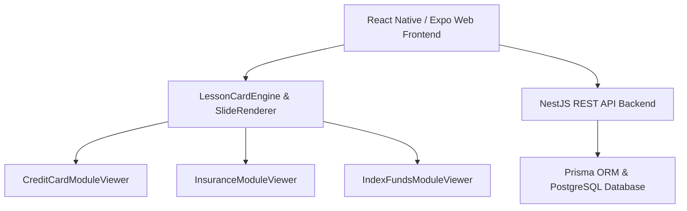

# 🛡️ Keep — Financial Literacy Micro-Learning Platform

[](https://keep-app-prototype.surge.sh)
[](https://reactnative.dev/)
[](https://www.typescriptlang.org/)
[](https://nestjs.com/)

**Keep** is a modern, interactive financial literacy learning platform inspired by gamified micro-learning principles. It turns complex financial concepts—such as credit utilization, insurance risk transfer, expense ratios, and SIP compounding—into bite-sized, interactive visual card decks and real-world path-driven scenarios.

---

## 🌟 Key Features & Interactive Learning Modules

### 💳 1. Credit Card Masterclass
- **Sequential Card Engine**: Explores the debit vs. credit math, ghost protocols, trust tests, and the difference between Transactors and Revolvers.
- **Dynamic Branching Routing**:
  - **Option A (No Income)**: Routes to tailored baseline guidance (`screen-10a-no-income`).
  - **Option B (Has Card)**: Interactive 30% credit limit utilization calculator (`screen-10b-yes-input`).
  - **Option C (Income, No Card)**: Step-by-step credit builder guide (`screen-10c-no-card-yet`).

### 🛡️ 2. Insurance Risk Shield
- **Interactive Risk Audit**: Evaluates personal health insurance and term life policy baselines.
- **Dynamic Protection Status Matrix**: Evaluates user choices on Screen 12 & 13 into real-time diagnostic output:
  - **Case A (Yes / Yes)**: `Strong Foundation` — Fully protected baseline.
  - **Case B (Mixed)**: `Partial Exposure` — Identifies coverage gaps.
  - **Case C (No / No)**: `Critical Vulnerability` — Actionable setup to build defense.

### 📈 3. Index Funds Masterclass
- **Bogle Manifesto & Expense Ratios**: Explains why 76%+ of active fund managers underperform the index over 15 years.
- **Interactive Forms & Live Compounding**: Captures age (`screen_11_age_input`) and monthly contributions (`screen_12_contribution_input`) to project retirement wealth.
- **Fallback Guidance**: Includes fallback routes for uncertain users (`don'tknow.html`).

### 🎯 4. Real-World Path-Driven Scenarios
- Step-by-step scenario simulator allowing users to run live numbers, make financial calls, and view instant net-worth & credit-score impacts.

---

## 🚀 Live Prototype

Test the live web application here:  
👉 **[https://keep-app-prototype.surge.sh](https://keep-app-prototype.surge.sh)**

---

## 🏗️ Architecture & Technology Stack



- **Frontend**: React Native, Expo Web, React Native Reanimated, TypeScript, Vanilla CSS Tokens
- **State Controllers**: React Context API State Controllers for Credit Cards, Insurance, and Index Funds
- **Backend API**: NestJS, TypeScript, RESTful endpoints for courses, lessons, and progress tracking
- **Database & ORM**: PostgreSQL, Prisma ORM
- **Deployment**: Surge (`https://keep-app-prototype.surge.sh`)

---

## 📁 Repository Structure

```text
.
├── mobile/                           # React Native / Expo Web Client
│   ├── src/
│   │   ├── components/
│   │   │   ├── CreditCardModule/     # Credit Card State Controller & Viewer
│   │   │   ├── InsuranceModule/      # Insurance State Controller & Viewer
│   │   │   ├── IndexFundsModule/     # Index Funds State Controller & Viewer
│   │   │   └── LessonCardEngine/     # Card Swipe Engine & Slide Renderer
│   │   ├── data/                     # Module JSON payload decks
│   │   ├── screens/                  # Home, Lesson, Profile, Scenario screens
│   │   └── navigation/               # React Navigation stack
├── backend/                          # NestJS REST API Server
│   ├── src/
│   │   ├── auth/                     # JWT Authentication
│   │   ├── course/                   # Course endpoints
│   │   ├── lesson/                   # Lesson endpoints
│   │   └── progress/                 # Gamification & XP progress tracking
│   └── prisma/                       # Database schema & seed scripts
├── raw_credit/                       # Extracted raw Credit Card HTML templates & tokens
├── raw_insurance/                    # Extracted raw Insurance HTML templates
└── raw_index/                        # Extracted raw Index Funds HTML templates
```

---

## 💻 Local Setup & Development

### 1. Prerequisites
- Node.js (v18+)
- npm or yarn

### 2. Run Mobile Web Frontend
```bash
cd mobile
npm install
npx expo start --web
```

### 3. Run Backend API Server
```bash
cd backend
npm install
npx prisma migrate dev
npm run start:dev
```

---

## 📝 License

This project is open source and available under the [MIT License](LICENSE).
